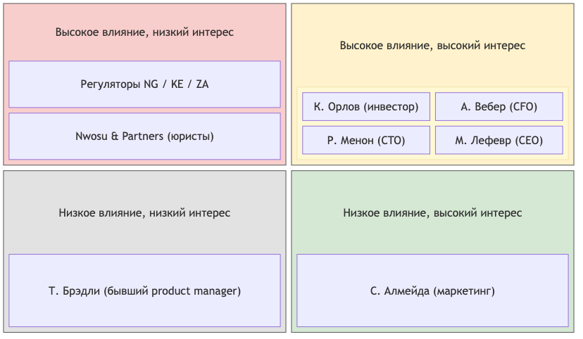

# Матрица стейкхолдеров

| Стейкхолдер | Интересы | Влияние | Вовлеченность | Приоритет при конфликте | Способ коммуникации |
|---|---|---|---|---|---|
| К. Орлов, инвестор | Дата 15.10 не двигается; система не падает; данные остаются в стране; продавцам платить в тот же день; стоимость решения | Высокое | Высокая | 1 - решающий голос во всех конфликтах | Одна страница, решения вместо проблем |
| А. Вебер, CFO | Потолок $5 тысяч/мес на инфраструктуру; платежи < 2,5% GMV; отсутствие долгосрочных предоплат | Высокое (бюджетное вето) | Высокая | 2 - блокирует любое решение дороже бюджета | Письменно, с цифрами, альтернативами и коммерческим обоснованием |
| Р. Менон, CTO | Cloud native, сертификация CNCF; 10M пользователей с первого дня; build-not-buy; экспертизац и интеграция Go, Oracle | Высокое | Высокая | 3 - владелец технических решений | Черновики ADR до встречи, технический язык в коммуникациях |
| М. Лефевр, CEO | Реалистичный план; четкое разделение скоупа первого релиза и последующих этапов | Высокое | Средняя | 4 - арбитр между инвестором и командой | Регулярные синки |
| С. Алмейда, Head of Marketing | Кампания 15.10 уже  оплачена; обещания в креативах напечатаны; дашборд запуска | Среднее | Высокая | 5 - ее обещания становятся фиксированными требованиями | Через CEO; каждое обещание фиксировать как НФТ |
| Nwosu & Partners, юристы (внешние) | Комплаенс NDPR / POPIA / KICA; лицензирование платежей | Среднее | Средняя | 6 - консультанты, блокируют архитектуру данных | Формальные письменные запросы; срок ответа 4-6 недель |
| Регуляторы (Нигерия, Кения, ЮАР) | Локализация и защита данных; лицензии на платежи | Высокое (санкции, блокировки) | Низкая | Жесткое ограничение, переговоры невозможны | Через юристов |
| Т. Брэдли, бывший product manager | Уволен | Нет | Нет | - | Его список из 29 функций - входные данные, а не требования |

## Диаграмма "Влияние / интерес"

Исходник: `stakeholder-power-interest.mmd`.
