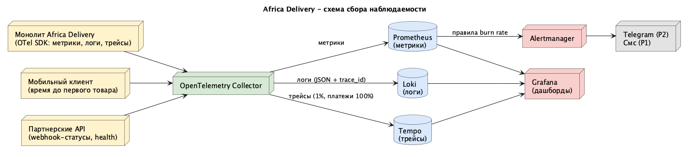

# Стратегия наблюдаемости

## 1. Золотые сигналы

| Сервис | Latency  | Traffic  | Errors  | Saturation  | Связанный SLI |
|---|---|---|---|---|---|
| Каталог | P99 чтения < 300 мс (гистограмма) | RPS по маршрутам | Доля 5xx | CPU/память подов, пул соединений БД | `slo/catalog.md`: доступность, задержка |
| Платежи | P95 инициации < 2 с | Платежей в мин по провайдерам | Доля неуспешных инициаций| Длина очереди повторов к провайдерам, соединения БД | `slo/payments.md`: доступность приема, завершения |
| Уведомления | Lag очереди (событие -> отправка в шлюз) < 60 с P95 | Событий в минуту | Доля недоставленных после всех retry | Глубина очереди, rate limit шлюза | `slo/notifications.md`: прием, своевременность |
| Платформа (общее) | - | - | - | Утилизация БД, Redis hit ratio > 90% | NFR-01, 02, 03, 04 |

Бизнес-метрики поверх технических - регистрации, заказы, GMV, успешные платежи, текущая глубина очередей

## 2. Инструменты

| Функция | Инструмент | Причина |
|---|---|---|
| Метрики | Prometheus, Alertmanager | опенсорс стек, стандарт CNCF, нулевая лицензия |
| Дашборды | Grafana | опенсорс стек, отдельный дашборд CEO с refresh 1 мин |
| Логи | structured JSON, trace_id в каждой строке | ELK в рамках текущих денежных ограничений избыточен |
| Трейсы | Jaeger + OpenTelemetry SDK в монолите | Стандарт OTel не привязывает к вендору  |
| Сбор | OpenTelemetry Collector | Единая точка маршрутизации метрик/логов/трейсов |
| Алерты | Alertmanager -> Telegram-группа дежурных + смс для P1 | Дублирование канала -  если упала сеть, то смс уйдет независимо |

## 3. Правила алертинга

- **P1** - будим дежурного, смс
- **P2** - Telegram, реакция в рабочие часы
- **P3** - задача в бэклог
- Запрет на алерты без владельца и без ссылок на runbook

## 4. Схема сбора

Исходник: `observability.puml`.

## 5. Ретеншен и стоимость

- Метрики: 15 дней полная детализация, 13 мес агрегаты - отчеты CFO и пересмотр SLO
- Логи: 7 дней горячие, 30 дней в S3
- Трейсы: sampling 1% базово, 100% на платежах и ошибках
- Оценка ресурсов стека: ~$200-250/мес внутри облачного бюджета
