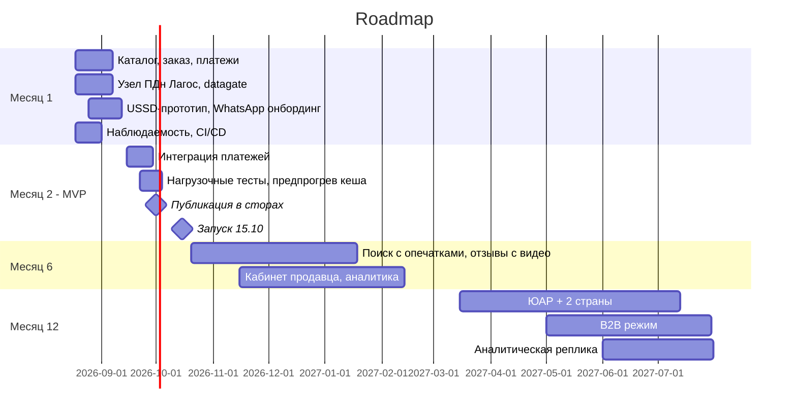

# Roadmap

## Решение по предложенным функциям

| Функция| Решение | Период | Причина/Критерий |
|---|---|---|---|
| Каталог, неограниченные категории | урезано в MVP - фиксированные категории пилота | MVP | неограниченные атрибуты рассматриваются как развитие на 1 год |
| Поиск с опечатками, 5 языков | урезано в MVP - PG FTS без опечаток | MVP / доработка мес 6 | 5000 SKU не требуют поискового движка |
| Голосовой поиск | Отложено | Год 2+ | Не нужен для цепочки заказа пилота, не обещан в креативах, не требование закона |
| ИИ-рекомендации | Отложено|Год 1 | Нет данных для обучения на пилоте |
| Live-стримы | Отложено | - | Креативы обещают стрим 17.10 - замена партнерскими стримами, своя разработка не укладывается в срок и команду |
| Чат покупатель-продавец | Отложено | Мес 6-12 | WhatsApp покрывает коммуникацию на пилоте |
| Отзывы с фото и видео | MVP без видео | MVP (текст+фото) | Доверие это центр позиционирования компании |
| Онбординг продавца WhatsApp | полностью в MVP | MVP | ожидается 100 продавцов, все они работают в WhatsApp |
|Онбординг продавца USSD | Отложено | Мес 12 | Продавцы пилота на смартфонах |
| Кабинет продавца с аналитикой | MVP: минимум (заказы, выплаты) в кабинете, аналитика отдельно | MVP / мес 6-12 | Есть риски не уложиться всроки запуска пилота, не является кор функциональностью |
| Оплата: M-Pesa, Flutterwave, Paystack, карта, перевод, наличные | урезано в MVP: M-Pesa + Flutterwave/Paystack | MVP | Без оплаты нет цепочки заказа|
| Рассрочка со своим скорингом | Отложено | Год 2 | кредитный продукт это отдельная лицензия и риск |
|  Мультивалютный кошелек | Отложено | Год 2 | требуется лицензия |
| Лояльность на криптотокенах | Отклонено как крипто; простая лояльность возможна позже MVP | Мес 12 (без крипто) | Регуляторные риски |
| Колесо фортуны | Отложено | Мес 6 | Не влияет на цепочку заказа пилота, является маркетинговой механикой второй очереди |
|  Флеш-распродажи с таймерами |урезано в MVP - TTL-hold без сложного резервирования | MVP | Таймеры обещаны в оплаченных креативах запуска |
| Динамическое ценообразование (парсинг Jumia) | Отложено | Год 1+ | Возможные правовые риски парсинга, не требуется для цепочки заказа пилота |
|Трекинг: живая карта, ETA до минуты | урезано в MVP - статусы партнера без карты | MVP / карта мес 12 | Статусы нужны для цепочки заказа,  живая карта требует сбора координат курьеров что может быть проблематично для апи партнеров|
|  Пункты выдачи с видеофиксацией | Отложено | Год 1+ | требуется заключение юристов |
|  Возвраты 30 дней, мгновенный рефанд | MVP - ручной процесс, срочность требует эскалации | MVP | Возврат 30 дней обещан в креативах, но мгновенный рефанд не подтвержден провайдерами что требует корректировки креативов  |
| ML-антифрод | MVP: правила проверки, ML позже | MVP / мес 12 | Базовая защита заказов нужна с первого дня; ML не научить при отсутствии данных |
| B2B-режим | Отложено | Мес 9-12 | Цель года 1, не пилота |
|Реферальная программа | Отложено | Мес 6-12 | Механика роста после проверки юнит экономики |
| Офлайн заказ USSD/смс | MVP полностью | MVP | Без офлайн канала теряем ~40% рынка |
| PWA + iOS + Android, полный паритет | урезано в MVP - Android + PWA | MVP / iOS мес 6-12 | Приложение это обязательный канал пилота, iOS-аудитория мала в сегменте |
|  Бэк-офис (модерация, KYC, споры) | урезано в MVP - минимум для операций | MVP | Без модерации и KYC продавцов запуск является незаконным|
|  Публичный GraphQL API | Отложено | Год 2 | Не является приоритетным кор функционалом для запуска |
|  Дашборд руководства realtime | MVP | MVP | Требование маркетинга -  живой дашборд в день запуска |
|  Темная тема | Отложено | Backlog | Не является приоритетным кор функционалом для запуска |

Итог: из 29 функций в MVP входят 11 (5 полностью, 6 в урезанном виде), 18 отложены или отклонены

## Контрольные точки

### Месяц 1 (15.09.2026) - контур заказа end-to-end

- **Scope:** каталог, заказ, платежи в Flutterwave/Paystack/M-Pesa, USSD прототип, узел ПДн Лагос развернут, CI/CD, наблюдаемость
- **Команда:** 6 контракторов, полная загрузка
- **Инфраструктура:** ~$3k/мес

### Месяц 2 (15.10.2026) - MVP, запуск

- **Scope:** 11 функций по таблице выше, нагрузочное тестирование, предпрогрев кеша и runbook запуска, дашборд CEO
- **Команда:** 6 контракторов + дежурства недели запуска
- **Инфраструктура:** ~$3k/мес

### Месяц 6 (15.03.2027) - после пилота

- **Scope:** поиск с опечатками, отзывы с видео, кабинет продавца с базовой аналитикой, чат или WhatsApp, колесо фортуны, оценка поддержки iOS, банковский перевод, B2B-дискавери
- **Команда:** пересмотр состава по итогам пилота и размораживания найма
- **Инфраструктура:** ~$4k/мес

### Месяц 12 (15.09.2027) - 5 стран

- **Scope:** выход в ЮАР + еще 2 страны, B2B-режим, реферальная программа, рекомендации на правилах, антифрод на ML, iOS при подтвержденной аудитории, аналитическая реплика
- **Команда:** по результатам разморозки найма
- **Инфраструктура:** ~$6k/мес

## Диаграмма Ганта

